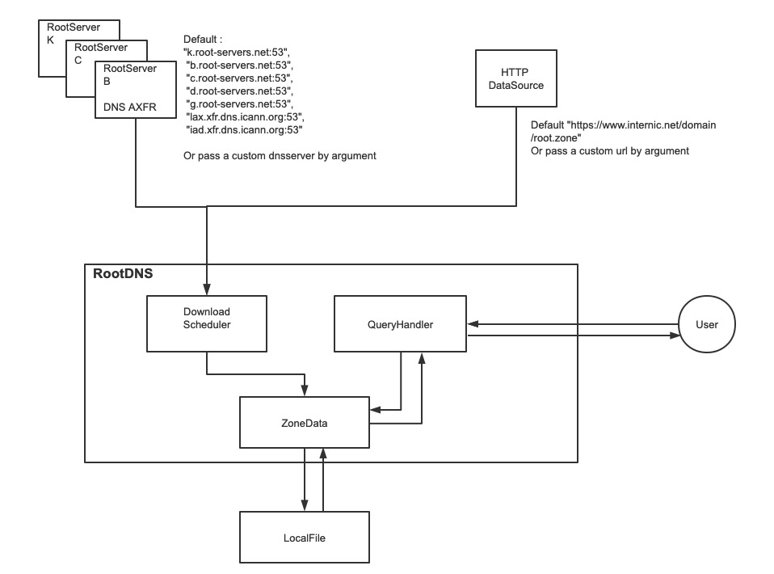

## LocalRoot 

LocalRoot is a lite dns server implemented rfc7706. 
Internally, data synchronization is achieved through polling. Currently, two polling methods are supported: http and axfr.

### 1. System Diagram

System diagram as below. you can set custom url or dns server for polling data. When data read, it will auto save to local storage.
So the server will still working even the upstream is down. If you have a local zone file, even without internet connection, the server will still provide dns response as a root server.




### 2. Server Install

- Download the release version for different platform. 
- Using Go tools. ```go get github.com/zhangmingkai4315/rootdns``` 
- Clone this repo to your computer and compile yourself.


### 3. Cli Argument

All the arguments list below.All arguments has default value, so you can start the sever without set any argument.
```shell
  -debug
        enable debug level log output
  -file string
        local root zone file (default "root.zone")
  -interval duration
        sync original root zone file from upstream server (default 1m0s)
  -listen string
        root dns server listen port (default "0.0.0.0:53")
  -prefer string
        custom prefer root servers or url for sync data
  -type string
        sync method for zone file only support axfr and http (default "axfr")

```

### 4. Todo list

- [ ] DNSSec Support (return correct rrsig data)
- [ ] Prometheus Metrics support
- [ ] Benchmark performance
- [ ] Automatic upload release binary
- [ ] Write more test 